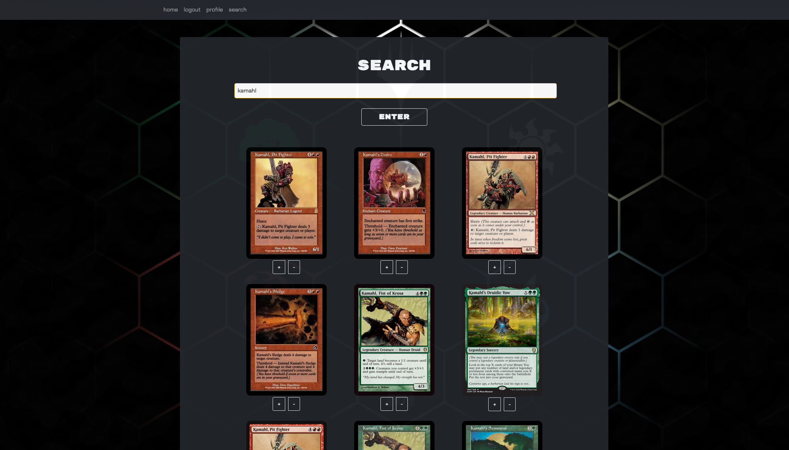

# DAJGY Deckbuilder App
Deck building app for Magic: The Gathering.

## Table of Contents
* [Description](#description)
* [Screenshot](#screenshot)
* [Link](#link)
* [Available-Scripts](#available-scripts)
* [Code](#code)
* [Presentation-Slides](#presentation-slides)
* [Contact](#contact)
* [Technologies](#technologies)
* [Project Status](#project-status)

## Description 
This app allows for user signup and creation of Magic: The Gathering decks. Users can create and edit decks, add cards using the search page, and view decks created by other users.

## Screenshot

## Available Scripts
In the project directory, you can run:

### `npm start`

Runs the app in the development mode.\
Open [http://localhost:3000](http://localhost:3000) to view it in your browser.

The page will reload when you make changes.\
You may also see any lint errors in the console.

### `npm run build`

Builds the app for production to the `build` folder.\
It correctly bundles React in production mode and optimizes the build for the best performance.

The build is minified and the filenames include the hashes.\
Your app is ready to be deployed!

## Link
[React Portfolio Website](https://tranquil-falls-52143.herokuapp.com/)
Follow this link to access the deployed version of the app.

## Code
[GitHub Code Repository](https://github.com/gluupo/dajgy-deckbuilder)

## Presentation Slides
[DAJGY Deck Presentation on Google Slides](https://docs.google.com/presentation/d/1Z1-n2RBuzl_47rU9D5wJ_HXdbPc6nS_eEpuvNQ795cs/edit?usp=sharing)

## Contact 
Created by:
* [@dcrlsn](https://github.com/dcrlsn)
* [@gluupo](https://github.com/gluupo)
* [@bigzeus2005](https://github.com/bigzeus2005)
* [@johny49](https://github.com/Johny49/)
* [@Ybyonas1](https://github.com/Ybyonas1)

## Technologies
- HTML
- CSS
- Node.js
- React.js
- Bootstrap
- GraphQL
- MongoDB
- Mongoose
- JWT

## Project Status
Project is: completed and functioning.

